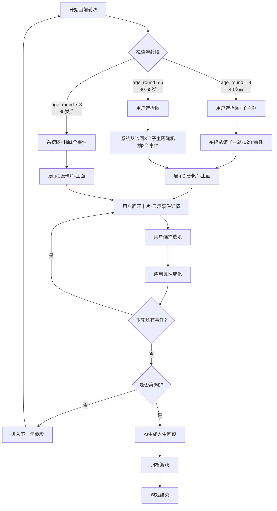
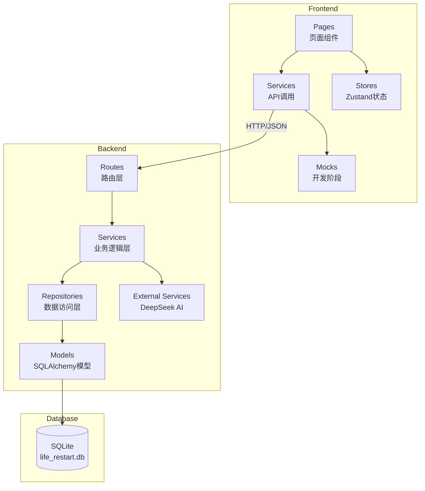
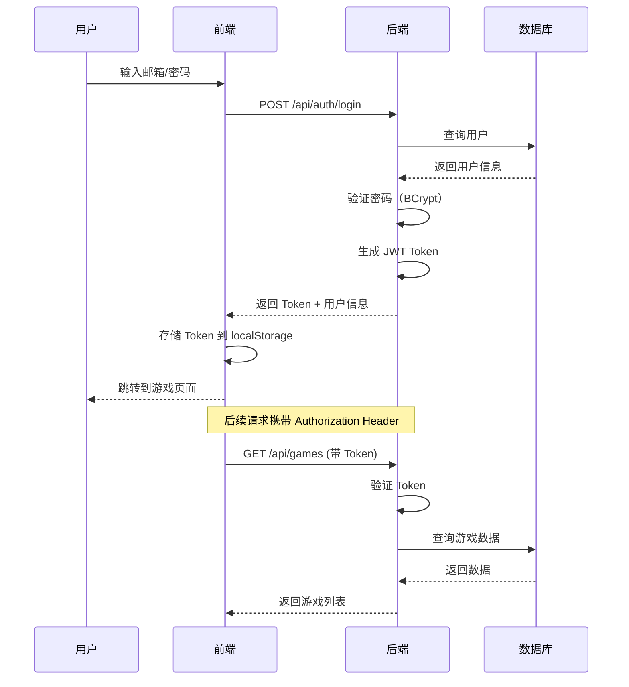
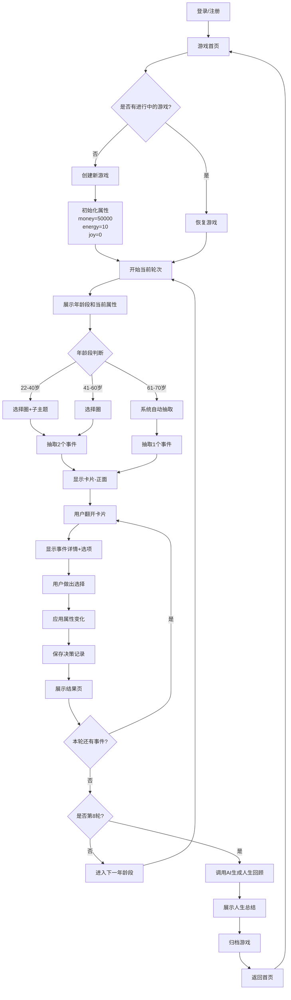
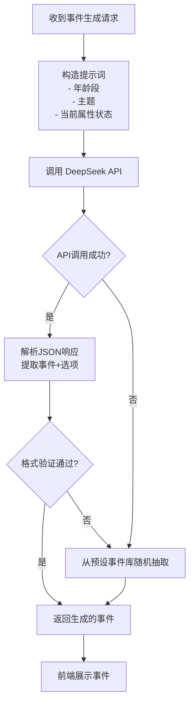

# 人生重启模拟器 - 产品需求文档（PRD）

> 版本：V1.0 定稿  
> 日期：2026-06-07  
> 状态：已确认，可进入开发

---

## 一、项目概述

### 1.1 背景与愿景

人生重启模拟器是一款轻松有趣的人生决策模拟游戏，玩家从 22 岁开始，经历不同年龄段的人生选择，通过事件抽取和决策影响三大属性（金钱、精力、快乐度），最终在 70 岁获得 AI 生成的人生回顾总结。

**核心体验：**
- 通过卡片翻转的视觉呈现探索不同人生可能性
- 每次决策影响三大属性，形成独特的人生轨迹
- AI 驱动的事件生成和人生回顾，每次游戏体验不同
- 轻量级游戏流程，单局 15-20 分钟

### 1.2 视觉方向

**设计风格：Playful Geometric（俏皮几何）**

采用 B+C 混合方案：
- **方案 B：**柔和渐变背景（紫-蓝-粉）+ 圆角卡片 + 细线图标
- **方案 C：**卡片翻转交互（正面主题图标，背面事件详情）

**核心视觉元素：**
- 主色调：渐变紫 `#7B68EE` → 渐变蓝 `#4A90E2` → 渐变粉 `#FFB6D9`
- 卡片：白色背景 + 12px 圆角 + 淡阴影
- 图标：细线风格（stroke-width: 2px）
- 动效：卡片翻转 0.6s ease-out

**原型文件位置：**
- 高保真原型：`docs/prototypes/index.html`（包含 01-login 至 08-history-detail 八个页面）
- 所有前端实现必须与原型文件中的文案、布局、配色、间距完全一致

---

## 二、功能模块

### 2.1 页面清单

| 页面编号 | 页面名称 | 功能说明 | 原型文件 |
|---------|---------|---------|---------|
| P01 | 登录页 | 邮箱/密码登录 | `docs/prototypes/01-login` |
| P02 | 注册页 | 邮箱注册并登录 | `docs/prototypes/02-register` |
| P03 | 首页 | 大标题 +「创建角色」「历史人生档案」 | `docs/prototypes/03-home` |
| P04 | 角色创建 | 姓名 + 金钱/精力/喜悦初始值可调 | `docs/prototypes/04-character-creation` |
| P05 | 对局主界面 | 左时间轴 + 中央翻牌事件 + 右圈/主题选择（单页完成整局） | `docs/prototypes/05-game-main` |
| P06 | 人生回顾 | 结局标签 + AI 总结 + 时间轴 + 再来一次 | `docs/prototypes/06-life-review` |
| P07 | 历史人生档案 | 已完成对局列表 | `docs/prototypes/07-history-list` |
| P08 | 历史复盘详情 | 只读回顾 + 基于此重开 | `docs/prototypes/08-history-detail` |

### 2.2 核心功能

#### F01：用户认证
- 邮箱 + 密码注册/登录
- JWT Token 认证
- 自动保持登录态（7 天）
- MVP 必需

#### F02：游戏创建与状态管理
- 创建新游戏，初始化三大属性：
  - 金钱（money）：50000
  - 精力（energy）：10
  - 快乐度（joy）：0
- 记录当前年龄段（age_round：1-8）
- 记录历史决策路径
- MVP 必需

#### F03：年龄段推进
**8 个年龄段：**
1. 22-25 岁（大学毕业-初入职场）
2. 26-30 岁（职场起步）
3. 31-35 岁（事业上升期）
4. 36-40 岁（中年危机前夜）
5. 41-50 岁（中年稳定期）
6. 51-60 岁（事业收官期）
7. 61-65 岁（退休过渡期）
8. 66-70 岁（晚年生活）

MVP 必需

#### F04：主题与事件系统

**16 个子主题（life 生活圈 8 个 + career 职业圈 8 个）：**

**生活圈：**
1. 健康管理（运动、体检、养生）
2. 家庭关系（伴侣、子女、父母）
3. 社交圈（朋友、社区、兴趣小组）
4. 休闲娱乐（旅游、爱好、游戏）
5. 财富管理（理财、房产、保险）
6. 自我成长（学习、阅读、心理调节）
7. 居住环境（搬家、装修、邻里）
8. 突发事件（意外、疾病、天灾）

**职业圈：**
1. 工作机会（跳槽、晋升、创业）
2. 职场关系（上司、同事、下属）
3. 技能提升（培训、考证、进修）
4. 工作压力（加班、裁员、业绩）
5. 收入变化（加薪、奖金、投资收益）
6. 行业趋势（转行、新技术、市场变化）
7. 副业探索（兼职、自媒体、咨询）
8. 退休规划（养老金、退休生活、遗产）

**事件抽取规则：**
- **40 岁前（age_round 1-4）：**用户选择生活/职业圈 + 1 个子主题 → 系统从该子主题随机抽 2 个事件卡片（卡片正面只显示"？"，背面显示事件详情）
- **40-60 岁（age_round 5-6）：**用户只选择生活/职业圈 → 系统从该圈的 8 个子主题随机抽 2 个事件
- **60 岁后（age_round 7-8）：**系统从 16 个子主题完全随机抽 1 个事件

**事件独立原则：**
- 同一轮次抽取的多个事件彼此独立，不共享状态
- 每个事件的选项效果只影响三大属性，不影响其他事件

**事件生成方式：**
- **优先使用 DeepSeek AI 生成**（配置 LLM_API_KEY、LLM_BASE_URL、LLM_MODEL）
- **降级方案：**若 AI 调用失败，使用预设事件库（每个子主题预存 20 个事件）

MVP 必需

#### F05：决策与属性变化
- 每个事件提供 2-3 个选项
- 每个选项影响三大属性（±金钱、±精力、±快乐度）
- 属性变化范围：
  - 金钱：-50000 ~ +50000
  - 精力：-5 ~ +5
  - 快乐度：-10 ~ +10
- 属性可为负数（表示负债、透支、痛苦）

MVP 必需

#### F06：游戏结束与 AI 生活回顾
- 完成第 8 轮（70 岁）后触发游戏结束
- 调用 DeepSeek AI 生成 200-300 字人生总结：
  - 分析三大属性最终状态
  - 总结关键决策节点
  - 提供人生评价（成功度、幸福度、遗憾度）
- **降级方案：**AI 调用失败时，返回模板化总结

MVP 必需

#### F07：游戏归档与历史记录
- 游戏结束后自动归档（状态从 `in_progress` 变为 `completed`）
- 用户可查看历史游戏列表
- 点击历史记录查看完整决策轨迹和 AI 总结

MVP 必需

#### F08：游戏中断与恢复
- 游戏中途退出不丢失进度
- 下次登录可继续未完成的游戏
- V2+ 功能

---

## 三、游戏规则详解

### 3.1 三大属性

| 属性 | 初始值 | 作用 | 范围 |
|-----|--------|------|------|
| 金钱（money） | 50000 | 财务状况，影响消费决策和生活质量 | 无上下限（可负债） |
| 精力（energy） | 10 | 身心健康，影响工作和生活选择 | 无上下限（可透支） |
| 快乐度（joy） | 0 | 幸福感，影响人生评价 | 无上下限 |

### 3.2 年龄段与轮次

- 共 8 个年龄段（age_round 1-8）
- 每个年龄段 = 1 轮游戏
- 每轮根据年龄段规则抽取 1-2 个事件
- 完成第 8 轮后游戏结束

### 3.3 事件抽取流程



### 3.4 卡片翻转交互（视觉方案 C）

**正面（未翻开）：**
- 显示大大的"？"图标
- 渐变背景（紫-蓝）
- 悬停时缩放 1.05 倍

**背面（翻开后）：**
- 显示事件标题和描述
- 2-3 个选项按钮
- 每个选项下方显示属性变化预览（如：金钱 +10000 / 精力 -2 / 快乐度 +3）

**翻转动画：**
- 3D 翻转效果（rotateY: 0deg → 180deg）
- 持续时间：0.6s
- 缓动函数：ease-out

---

## 四、数据契约确认清单

### 4.1 核心实体

#### User（用户）
- `id`：整数，主键
- `email`：字符串，唯一索引
- `password_hash`：字符串（BCrypt）
- `created_at`：时间戳

#### Game（游戏记录）
- `id`：整数，主键
- `user_id`：整数，外键 → User.id
- `status`：枚举（`in_progress` / `completed`）
- `age_round`：整数（1-8）
- `money`：整数
- `energy`：整数
- `joy`：整数
- `decisions`：JSON 数组（历史决策）
- `ai_review`：字符串（AI 生成的人生总结，仅 completed 时有值）
- `created_at`：时间戳
- `updated_at`：时间戳

#### Decision（单次决策记录，存储在 Game.decisions JSON 中）
- `round`：整数（1-8）
- `age_range`：字符串（如 "22-25"）
- `circle`：字符串（"life" / "career"）
- `theme`：字符串（子主题名称，如 "健康管理"）
- `event_title`：字符串
- `event_description`：字符串
- `chosen_option`：字符串
- `money_change`：整数
- `energy_change`：整数
- `joy_change`：整数

### 4.2 统一响应格式

**成功响应：**
```json
{
  "code": 200,
  "message": "success",
  "data": { ... }
}
```

**错误响应：**
```json
{
  "code": 4001,
  "message": "用户名或密码错误",
  "data": null
}
```

**分页响应：**
```json
{
  "code": 200,
  "message": "success",
  "data": {
    "items": [...],
    "total": 100,
    "page": 1,
    "page_size": 20
  }
}
```

---

## 五、外部依赖与配置

### 5.1 DeepSeek AI 服务

**用途：**
1. 动态生成游戏事件（根据年龄段、主题、属性状态）
2. 生成人生回顾总结

**配置项：**
- `LLM_API_KEY`：DeepSeek API Key（用户已提供，存储在 `backend/.env`）
- `LLM_BASE_URL`：https://api.deepseek.com/v1
- `LLM_MODEL`：deepseek-chat

**状态：**已确认（用户已提供 Key 并存储在 backend/.env）

**降级策略：**
- 事件生成失败 → 使用预设事件库
- 生活回顾失败 → 返回模板化总结

### 5.2 本地存储

**数据库：**SQLite（开发/演示用）  
**路径：**`backend/data/life_restart.db`

**备注：**V2+ 可迁移到 PostgreSQL

---

## 六、路线图（版本规划）

### MVP 版本（V1.0）
- ✅ 邮箱/密码认证
- ✅ 完整 8 轮游戏流程
- ✅ 16 个子主题 + DeepSeek AI 事件生成
- ✅ 卡片翻转 UI
- ✅ AI 人生回顾
- ✅ 游戏归档与历史记录查看

### V2.0（增强体验）
- 游戏中断与恢复
- 社交分享（分享人生总结到社交媒体）
- 成就系统（解锁特殊结局徽章）
- 多种视觉主题切换

### V3.0（社区功能）
- 好友系统（查看好友的人生轨迹）
- 排行榜（财富榜、幸福榜）
- 自定义事件编辑器

---

## 七、技术架构蓝图

### 7.1 技术选型

#### 前端
- **框架：**React 18 + TypeScript
- **构建工具：**Vite 5
- **路由：**react-router-dom 6
- **状态管理：**Zustand
- **请求库：**Axios
- **UI 组件库：**Ant Design Mobile（移动端优先）
- **动画：**CSS3 Transitions + React Transition Group

#### 后端
- **框架：**FastAPI + pycore 框架
- **语言：**Python 3.11+
- **数据库：**SQLAlchemy ORM + SQLite
- **认证：**JWT（python-jose）
- **外部服务：**httpx（调用 DeepSeek API）

### 7.2 分层架构



### 7.3 认证流程



### 7.4 部署方案

**开发阶段：**
- 前端：Vite dev server（端口 5199）
- 后端：Uvicorn（端口 8099）

**用户门禁验收：**
- 前端：Vite dev server（端口 5175）
- 后端：Uvicorn（端口 8003）

**生产环境（V2+）：**
- 前端：静态文件托管（Vercel / Cloudflare Pages）
- 后端：Docker 容器 + Nginx 反向代理

---

## 八、核心流程图

### 8.1 完整游戏主流程



### 8.2 AI 事件生成流程



---

## 九、组件交互说明

### 9.1 前端模块依赖

```
src/
├── pages/              # 8个页面组件
│   ├── Login.tsx       # P01 - 依赖 auth service
│   ├── GameConfig.tsx  # P02 - 依赖 game service
│   ├── AgeSelect.tsx   # P03 - 依赖 game store
│   ├── ThemeSelect.tsx # P04 - 依赖 theme config
│   ├── EventDraw.tsx   # P05 - 依赖 game service
│   ├── DecisionResult.tsx # P06 - 依赖 game store
│   ├── LifeReview.tsx  # P07 - 依赖 game service
│   └── HistoryDetail.tsx # P08 - 依赖 archive service
├── services/           # API调用层
│   ├── auth.ts
│   ├── game.ts
│   └── archive.ts
├── stores/             # Zustand状态管理
│   ├── authStore.ts
│   └── gameStore.ts
├── mocks/              # Mock数据（开发阶段）
│   └── handlers.ts
└── types/              # TypeScript类型定义
    ├── user.ts
    ├── game.ts
    └── api.ts
```

### 9.2 后端模块依赖

```
backend/src/
├── api/
│   ├── routes/
│   │   ├── auth.py     # 认证路由 - 依赖 user service
│   │   ├── game.py     # 游戏路由 - 依赖 game service, AI service
│   │   └── archive.py  # 归档路由 - 依赖 game service
│   └── deps.py         # 依赖注入（get_current_user, get_db）
├── services/
│   ├── user_service.py    # 用户业务逻辑 - 依赖 user repo
│   ├── game_service.py    # 游戏业务逻辑 - 依赖 game repo, AI service
│   └── ai_service.py      # AI调用服务 - 依赖 httpx
├── repositories/
│   ├── user_repo.py       # 用户数据访问
│   └── game_repo.py       # 游戏数据访问
├── db/
│   ├── models.py          # SQLAlchemy模型
│   └── session.py         # 数据库会话管理
└── core/
    └── config.py          # 基于 pycore.core.ConfigManager
```

---

## 十、技术选型与风险

### 10.1 关键技术决策

| 决策点 | 选择 | 理由 | 风险与缓解 |
|--------|------|------|-----------|
| AI 服务商 | DeepSeek | 成本低、中文效果好、API稳定 | 降级预设事件库 |
| 数据库 | SQLite | 单机部署简单、无需运维 | V2迁移PostgreSQL |
| 前端框架 | React | 生态成熟、开发效率高 | 包体积较大→代码分割 |
| 移动端适配 | H5 响应式 | 无需原生开发、跨平台 | 性能不如原生→优化渲染 |
| 认证方案 | JWT | 无状态、易扩展 | Token泄露风险→设置短过期时间 |

### 10.2 已知风险

**技术风险：**
1. **DeepSeek API 限流/故障**
   - 缓解：预设事件库作为降级方案
   - 缓解：客户端显示"生成中"加载状态

2. **SQLite 并发限制**
   - 影响：多用户同时操作可能阻塞
   - 缓解：V2 迁移 PostgreSQL

3. **前端包体积**
   - 影响：首屏加载慢
   - 缓解：代码分割 + 懒加载

**业务风险：**
1. **AI 生成内容不可控**
   - 影响：可能生成不合适内容
   - 缓解：提示词约束 + 内容过滤关键词

2. **游戏平衡性调优**
   - 影响：属性变化幅度可能影响体验
   - 缓解：收集用户反馈，迭代调整数值

---

## 十一、PRD 自检清单

- [x] 没有"待定"、"TBD"、"后续补充"等占位符
- [x] 每个功能模块都有明确的优先级（MVP / V2+）
- [x] 核心流程图覆盖了主流程和异常分支
- [x] 技术选型已确定
- [x] PRD 内容与已确认的原型一致（`docs/prototypes/index.html`）
- [x] 包含路线图、架构蓝图、原型说明章节
- [x] 外部服务配置已确认（DeepSeek Key 已提供）
- [x] 数据契约清单完整

---

## 十二、变更记录

| 版本 | 日期 | 变更内容 | 变更人 |
|------|------|---------|--------|
| V1.0 | 2026-06-07 | 初始定稿版本，Phase C 完成 | AI Assistant |

---

**PRD 状态：已确认，可进入开发阶段**
